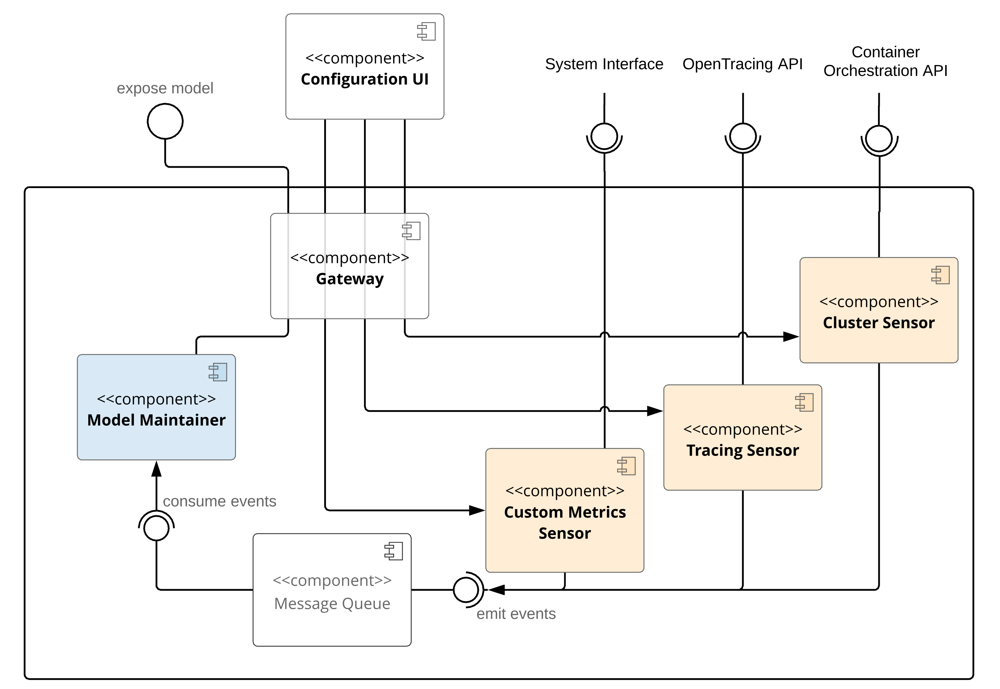
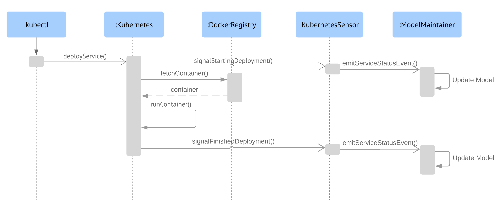
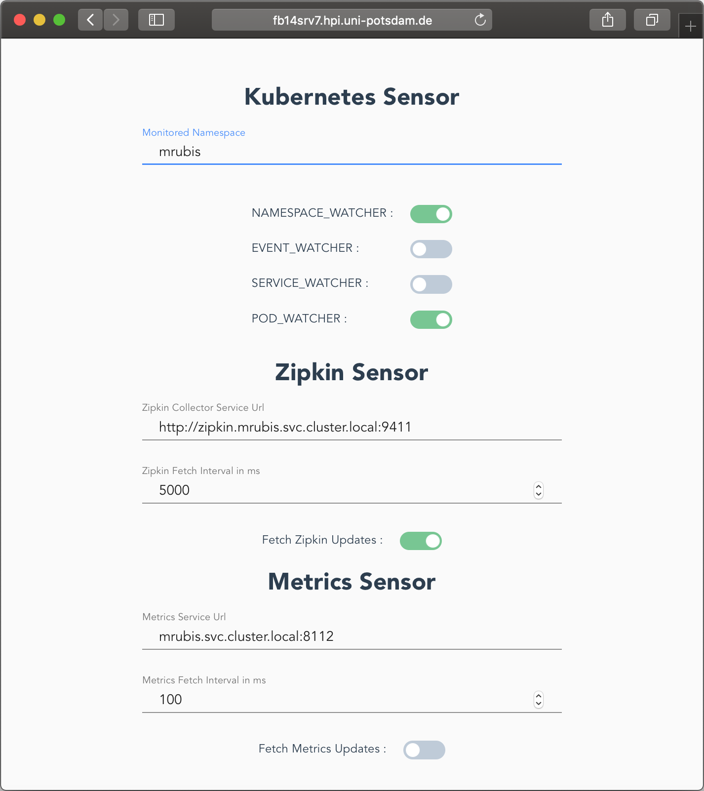

# Distributed Monitoring

This application generates runtime architecture models for microservice systems deployed to kubernetes.
It uses the kubernetes API to retrieve and update deployment related data.
The data is used to generate a CompArch model which can be used to explore the architecture and implement self-adaptation.
Furthermore, zipkin is used to explore dependecies between the services and add their interfaces and their usage to the model.
The CompArch implementation is copied from [thomas-vogel/mRUBiS](https://github.com/thomas-vogel/mRUBiS). 

## System Overview







## Prerequisites
* git
* docker, docker-compose
* gradle (optional)
* kubectl *(kubernetes cli)*
* kompose *(docker-compose wrapper for kubernetes)*

if you have gradle installed locally you can use it to run build tasks.
Otherwise, you can use the executable wrapper file `gradlew` (or for windows `gradlew.bat`)

## Run Locally

**via Docker**

* create docker images with `./gradlew docker`
* simply run `docker-compose -f docker-compose.local.yml up`
* verify by running `curl localhost:8003/model`

**as spring boot**

* build all projects with `./gradlew build`
* build single project with `./gradlew kubernetes-consumer:build`
* run with `./gradlew kubernetes-consumer:bootRun`

## Run in local kubernetes
* start a local docker registry with: 
```bash
docker run -d -p 5000:5000 --restart=always --name registry registry:2
```
* tag & push images to registry:
```bash
scripts/tagAndPushDockerImages.sh
```
* deploy to kubernetes with `kompose up`
* verify pods are running with `kubectl get pods`
* check out the [local dashboard](http://127.0.0.1:8001/api/v1/namespaces/kube-system/services/https:kubernetes-dashboard:/proxy)
(you need to have kubectl proxy running `kubectl proxy` and might need to adjust the port)

Create the target namespace before deployment.
```bash
kubectl create -f scripts/namespace.json
```

run with docker stack:
```bash
docker stack deploy --namespace dm --compose-file docker-compose.yml dm
```
remove stack with docker stack:
```bash
docker stack rm --namespace dm dm
```

## Run on kubernetes
* make sure the kompose files (dm.yml is up to date)
* generate with `REGISTRY=stephde TAG=latest kompose convert -f ../docker-compose.hub.yml -o kompose/dm.yml`
* make sure `imagePullPolicy: Always` is set for all containers in dm.yml so that kubernetes always uses the newest images
* run `kubectl apply kompose/dm.yml -n dm` to create monitoring setup in namespace `dm`
* find out the ip of the gateway with `kubectl get svc -n dm`
* use `vagrant ssh k8s1` to ssh into the virtual kubernetes master node
* set the gateway ip in `/etc/nginx/nginx.conf` and reload with `sudo nginx -s reload` 


## Monitor an application
The namespace of the target application needs to match the namespace in the application.properties of the monitor.
Otherwise, it can also be adjusted at runtime by calling the `POST /namespace` endpoint (as in `scripts/changeNamespace.sh`)

### Running the monitoring UI
* run as docker image on server
* set API url in UI (e.g. to `http://fb14srv7.hpi.uni-potsdam.de:1800/kube-consumer`)

## Events on Replication

```bash
# after build, tag & push
scripts/tagAndPushDocker.sh

# deploy stack
docker stack deploy --namespace dm --compose-file docker-compose.yml dm

# get pods in namespace
kubectl --namespace=dm get pods

# attach to logs of monitor pod
kubectl logs -f monitor-7dcf74c57c-kp69z --namespace dm

# trigger scale
kubectl --namespace=dm scale --replicas=2 deployment/activemq

# remove stack
docker stack rm --namespace dm dm
```


## Zipkin

http://localhost:9411/zipkin/api/v2/dependencies?endTs=1545921678313

[swagger](https://zipkin.io/zipkin-api/)

## Gateway
* the gateway is a simple nginx based proxy
* any service that should be accessible from outside the cluster needs to be configured here
* build docker image with `docker build -t stephde/nginx:latest .`

## How to add a module
* use spring boot starter
* add new module to settings.gradle
* ...


## FAQ
How do I scale a service?
```
kubectl scale --replicas=2 deployments/workloademulator
```

## Known Issues
* version mismatch between zipkin-consumer -- zipkin -- spring-sleuth instrumentation


## Notes

* remove container
```
2018-12-14 14:37:43 -- INFO  -- c.k.w.EventWatcher	: 
KubeEvent(super=WatchableEntity(name=derbydbtestit-65bcc979fc-zxslz, namespace=dm, creationTime=2018-12-14T14:37:43.000Z), 
    lastTimestamp=2018-12-14T14:37:43.000Z, 
    message=Killing container with id docker://derbydbtestit:Need to kill Pod, 
    reason=Killing, related=, type=Normal, source=kubelet, 
    name=derbydbtestit-65bcc979fc-zxslz)
```

* container status in pod events is still pending after this though...

* get dashboard token
```
kubectl -n kube-system describe secret $(
  kubectl -n kube-system get secret | \
  awk '/^deployment-controller-token-/{print $1}'
) | \
awk '$1=="token:"{print $2}'
``` 

* docker stack use kubernetes orchestrator
DOCKER_STACK_ORCHESTRATOR=kubernetes